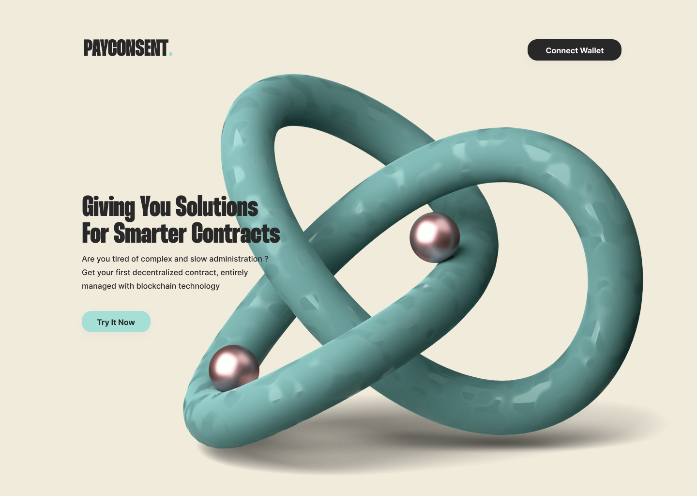

  

## 🤏 Pitch
#### Where does the idea of payconsent come from ?
Actually, we, as newly freelance devs, have been experiencing issues with a client payment. Even to this day we did not receive the money. 
We wanted to solve this problem using Blockchain technology.
And that’s how we thought about Payconsent.

## 📔 Summary

 - [❗ Problem](#-problem)
 - [✅ Solution](#-solution)
 - [⚙️ How to run the project ?](#%EF%B8%8F-how-to-run-the-project-)
 - [🦶 Step to use Payconsent](%-step-to-use-payconsent)
 - [💡 Technological invasion](%-technological-invasion)
 - [📈 Business model](#-business-model)
 - [🖥️ Development perspective](#%EF%B8%8F-development-perspective)
  
## ❗ Problem
#### What problem does your project solve? 
1. Contract falsification  
2. Deadline for payement not respected  
3. Terms of contract not respected  
  
#### How does it fit into the theme "Building a Decentralized Future"?  
The solution is independant, self governing.  
    
## ✅ Solution
#### How did you resolve this issue?  
1. We decided to solve this issue, by creating an easy to use and decentralized payement protocol service that protect the 2 users during transaction (service-for-money).  
2. For each mission, we create a unique smart contract that is not editable and not replicable.  
3. We store the documents on decentralised database (IPFS).
  
It is a simply-to-use contract creator tool that allows any users to create their own traditional contract, but…. directly on blockchain !  
  
We create a climate of trust for every users (Open Trust Framework Model).  
  
#### What technologies did you use?
- Escalidraw for project diagram  
- Figma to design and prototype the website  
- Trello to manage the project development  
- TailwindCSS and ReactJS for frontend
- Starton API for the smart contracts managements and ipfs file upload
- IPFS for the decentralised datastorage  
  
#### What was your biggest technical challenge and how does your solution solve it?
We never worked on Web3 before, so the biggest technical challenge was to give user the ability to write his own smart contract without knowledge.  
Our solution solve it by creating a form interface that write directly into our smart contract.  

## ⚙️ How to run the project ? 
  
1. Clone the repository:  
`https://github.com/ethan0905/PAYCONSENT.git`  
  
2. Run at the root of repository, the following bash commands:  
`npm install && npm run dev`
  
3. Then go to the following url on internet:  
`localhost:3000`

## 🦶 Step to use Payconsent

- Connect your wallet
- Fill the form and upload the different file
- Start the mission ✔️

## 💡 Technological invasion

- The contract will be unique with the smart contract
- The file will be storage with ipfs (no centralized data)

## 📈 Business model

  1.  Free to use under 1000$.  
      -> Goal: Increase user adoption and grow daily user database.  
  2.  For each contract, we take 5% pourcent of the total amount.  
  3.  Once we have enough daily users, fundraising with money going into:  
      a) 10% of capital into marketing  
      b) 15-20% of capital into development  
  4.  In case of disagreement, we take extra 10% of the funds to pay external services.  
      -> Way to dissuade the two sides to not respect the terms and agreements of the contract.  
  5.  We plan to have self formed conciliators in the payconsent team, to review desagreements. If the problem persists:  
      -> The justice split.  
  
## 🖥️ Development perspective

- Have a little check of the delivery service
- Create a DAO
- Create our coin, the more user is holding, the less the additionnal fees gonna be
- Holder of our coin will gonna get rewarded for voting in case of disagreement
- Add a service provider marketplace like malt
- Create a certification after an amount of contract validate

