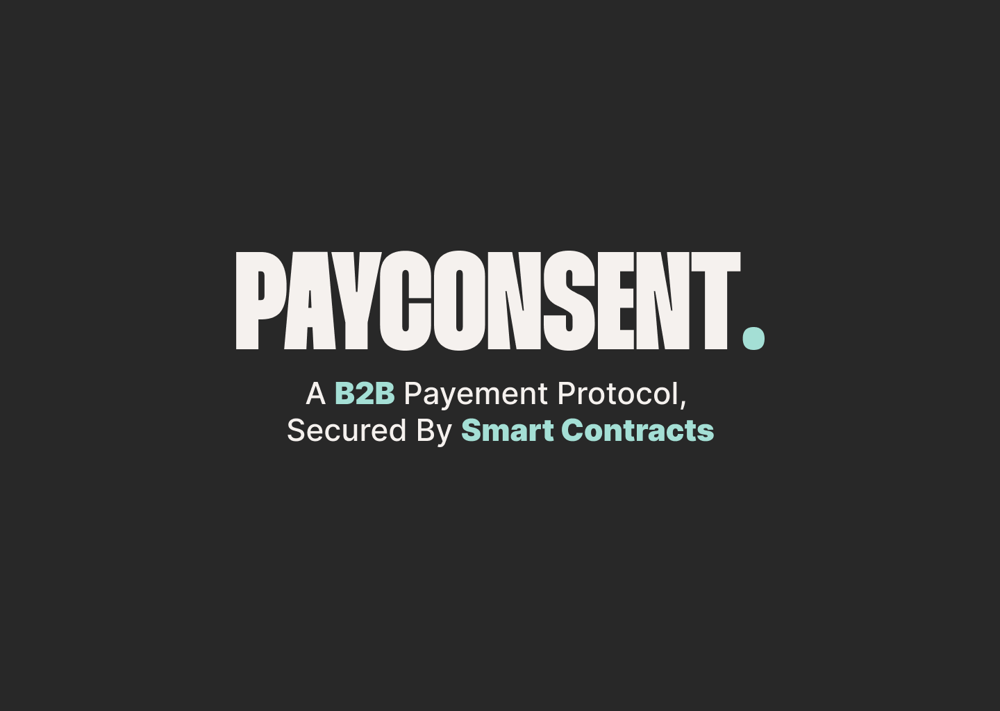

  

## 🤏 Pitch
We are 4 students from 42 school and we have been experiencing issues with our client payement (deadline, terms of contract, ...).  
In order to solve this problem, using Blockchain technology is interesting. 
 
## 📔 Summary

 - [❗ Problem](#-problem)
 - [✅ Solution](#-solution)
 - [⚙️ How to run the project ?](#%EF%B8%8F-how-to-run-the-project-)
 - [🦶 Step to use Payconsent](%-step-to-use-payconsent)
 - [💡 Technological invasion](%-technological-invasion)
 - [📈 Business model](#-business-model)
 - [🧭 Roadmap](#-roadmap)
 - [🖥️ Development perspective](#%EF%B8%8F-development-perspective)
 - [⚠️ License](#%EF%B8%8F-license)
  
## ❗ Problem
#### What problem does your project solve? 
1. Contract falsification  
2. Deadline for payement not respected  
3. Terms of contract not respected  
  
#### How does it fit into the theme "Building a Decentralized Future"?  
The solution is independant, self governing.  
    
## ✅ Solution
#### How did you resolve this issue?  
1. We decided to solve this issue, by creating an easy to use and decentralized payement protocol service that protect the 2 users during transaction (service-for-money).  
2. For each mission, we create a unique smart contract that is not editable and not replicable.  
3. We store the documents on decentralised database (IPFS).
  
We create a climate of trust for every users (Open Trust Framework Model).  
  
#### What technologies did you use?
- Escalidraw for project diagram  
- Figma to design and prototype the website  
- Trello to manage the project development  
- TailwindCSS and ReactJS for frontend and backend  
- Starton API for the smart contracts managements
- IPFS for the decentralised datastorage  
  
#### What was your biggest technical challenge and how does your solution solve it?
We never worked on Web3 before, so the biggest technical challenge was to give user the ability to write his own smart contract without knowledge.  
Our solution solve it by creating a form interface that write directly into our smart contract.  

## ⚙️ How to run the project ? 
  
1. Clone the repository:  
`https://github.com/ethan0905/PAYCONSENT.git`  
  
2. Run at the root of repository, the following bash commands:  
`docker-compose up --build`
  
3. Then go to the following url on internet:  
`localhost:3000`

## 🦶 Step to use Payconsent

- Connect your wallet
- Fill the form and upload the different file
- Start the mission ✔️

## 💡 Technological invasion

- The contract will be unique with the smart contract
- The file will be storage with ipfs (no centralized data)

## 📈 Business model

- For each contract, we take a pourcentage of the total amount (6% for services)
- Create a coin and add staking during the mission
- Add different type of contract
- We just need a team with several developper
- A contract less than 100$ will be free to attract some users
- With a DAO, we didn't a huge fund rising 

## 🖥️ Development perspective

- Have a little check of the delivery service
- Create a DAO
- Create our coin, the more user is holding, the less the additionnal fees gonna be
- Holder of our coin will gonna get rewarded for voting in case of disagreement
- Add a service provider marketplace like malt
- Create a certification after an amount of contract validate

## ⚠️ License
Distributed under the MIT License. See `LICENSE.txt` for more information.  

## Video
  
https://www.loom.com/share/1ff00228b6df424e9d997bd729f17145  
  
